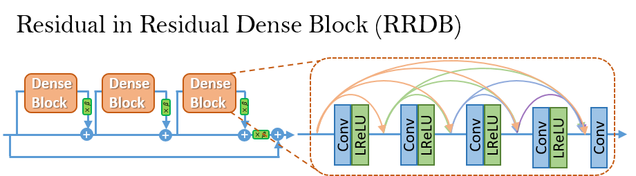

# Super_Resolution

This web app implements a pre-trained [Super-Resolution paper](https://arxiv.org/pdf/2107.10833). The pre-trained model I used is provided on GitHub by [XINNTAO](https://github.com/xinntao/ESRGAN).

## Steps to implement
1. git clone https://github.com/gautam2905/Super_Resolution_Pretrained.
2. Download pre-trained models from [Google Drive](https://drive.google.com/drive/u/0/folders/17VYV_SoZZesU6mbxz2dMAIccSSlqLecY) provided by XINNTAO. Place the models in `./models`.
3. Create a virtual environment.
4. Install the dependencies.
    * pip3 install torch torchvision torchaudio --index-url https://download.pytorch.org/whl/cu118
    * pip install -r requirements.txt
5. Run the `webapp.py`
6. Upload the image.
7. The resulting image will also be saved in the result folder.

## ESRGAN
We improve the [SRGAN](https://arxiv.org/abs/1609.04802) from three aspects:
1. adopt a deeper model using a Residual-in-Residual Dense Block (RRDB) without batch normalization layers.
2. employ [Relativistic average GAN](https://ajolicoeur.wordpress.com/relativisticgan/) instead of the vanilla GAN.
3. improve the perceptual loss by using the features before activation.

In contrast to SRGAN, which claimed that **deeper models are increasingly difficult to train**, our deeper ESRGAN model shows its superior performance with easy training.

  

  

